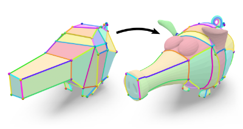

# LayoutEmbedding

This is an implementation of the method presented in the paper [Layout Embedding via Combinatorial Optimization](https://www.graphics.rwth-aachen.de/publication/03329/) at Eurographics 2021.



This repository contains:
* The core `LayoutEmbedding` library.
* Example applications that replicate experiments and figures from the Eurographics 2021 paper.
* Command-line utilities.

## Build Instructions

The following instructions have been tested on Linux (Debian 10, Linux Mint 19.3 and Ubuntu LTS 20.04).
Other platforms might require different build steps.

Make sure to checkout all Git submodules:
Clone via `git clone --recursive ...` or do `git submodule update --init --recursive` afterwards.

Please install the required dependencies (using the following commands on Debian-based systems):
* C++17 compiler (GCC >= 8) (`sudo apt install build-essential`)
* CMake (`sudo apt install cmake`)
* OpenGL (`sudo apt install libgl1-mesa-dev mesa-utils`)
* GLFW build dependencies (`sudo apt install libglfw3 libglfw3-dev`)
* libxi dependencies (`sudo apt install libxinerama-dev libxcursor-dev libxi-dev`)

Then, navigate to the cloned repository and build:
```
mkdir build
cd build
cmake ..
make -j4
```

## Figures and Experiments

Source code for figures and experiments in the paper is found in the `apps/eg2021` folder.
Run the following executables to replicate the results:

* `pig_figure` (Fig. 1)
* `homotopy_cube_figure` (Fig. 2)
* `quad_animals_figure` (Fig. 3)
* `optimization_timeline_figure` (Fig. 7)
* `jitter_evaluation_figure` (Fig. 13)
* `quad_hands_figure` (Fig. 14)
* `inter_surface_map_figure` (Fig. 15)
* `disk_face_figure` (Fig. 16)
* `disk_hand_figure` (Fig. 16)

Output files and images will be written to the `build/output` directory.
The above executables accept an optional `--viewer` argument to open an interactive viewer widget.
Executables that produce multiple images will open several viewer widgets successively.
Use the following controls:
* Center camera via double click.
* Rotate camera via left mouse drag.
* Close by pressing <kbd>Esc</kbd>.

To replicate the SHREC07 evaluation (Figs. 10, 11, and 12), run the following executables in the correct order.
Note that `shrec07_embed_layouts` takes ~24h to run.

* `shrec07_generate_layouts`
* `shrec07_embed_layouts` (data for Fig. 10, requires `shrec07_generate_layouts`)
* `shrec07_figure` (Fig. 11, requires `shrec07_embed_layouts`)
* `shrec07_ablation` (Fig. 12, requires `shrec07_generate_layouts`)

Run `shrec07_view` to inspect the results of `shrec07_embed_layouts`.
Use the <kbd>Left</kbd> and <kbd>Right</kbd> arrow keys to navigate through the results.
You can pass the SHREC07 mesh ID as a command line argument to start at a specific model.

## Command Line Interface

The `embed` command provides a command-line interface to our algorithm.
Use `view_embedding` to inspect previously computed embeddings.

Both commands provide a `--help` argument for further details.

## Authors and Contributors

* [Janis Born](https://www.graphics.rwth-aachen.de/person/97/)
* [Patrick Schmidt](https://www.graphics.rwth-aachen.de/person/232/)
* [Sasa Lukic](https://www.graphics.rwth-aachen.de/person/300/)
* [Leif Kobbelt](https://www.graphics.rwth-aachen.de/person/3/)

## License

This project is released under the **MIT License**.
